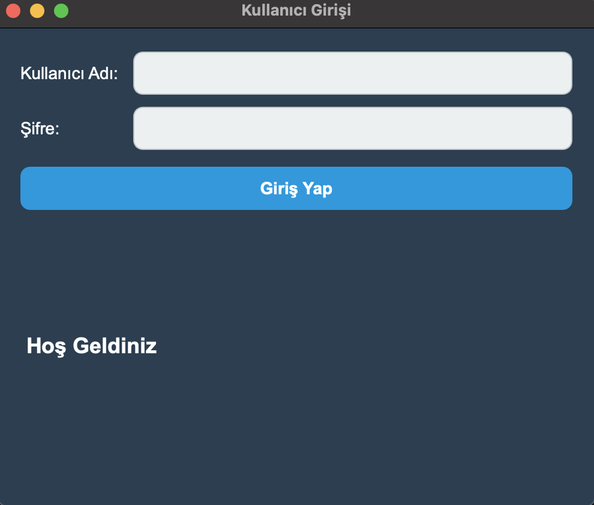
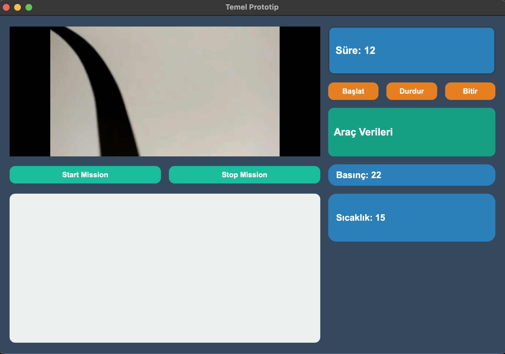

# 🖥️ PyQt5 Vehicle Control and Video Simulation GUI

Bu proje, **PyQt5** kullanılarak geliştirilmiş temel bir **GUI prototipi**dir.  
Kullanıcı girişi, video oynatma, görev başlat/durdur butonları, araç verileri simülasyonu ve zamanlayıcı özelliklerini içerir. Eğitim ve demo amaçlı bir uygulamadır.

---

## ✨ Özellikler
- **Kullanıcı Girişi:** Basit kullanıcı adı ve şifre kontrolü
- **Video Oynatma:** PyQt5 QMediaPlayer ve QVideoWidget kullanımı  
- **Görev Butonları:** Start/Stop/Finish görev simülasyonu
- **Zamanlayıcı:** Proje içinde süre takip ve güncelleme
- **Araç Verileri:** Basınç ve sıcaklık değerlerini rastgele simüle etme
- **GUI Düzeni:** GridLayout ile modern ve kullanışlı arayüz tasarımı
- **Dinamik Etkileşim:** Butonlarla video ve zamanlayıcı kontrolü

---

## 🛠️ Kullanılan Teknolojiler
- Python 3  
- PyQt5 (GUI tasarımı)  
- QMediaPlayer / QVideoWidget (video oynatma)  
- QTimer (zamanlayıcı)  
- NumPy (veri simülasyonu)  
- random (rastgele veri üretimi)  

---

## 📸 Örnek Ekran Görüntüleri

### Giriş Ekranı

### Ana Ekran

