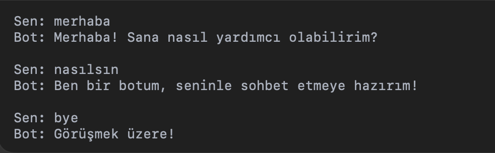

# 📨 Python Chatbot with Socket Programming

Bu proje, **Python socket programlama** kullanılarak geliştirilmiş basit bir **client-server chatbot** uygulamasıdır.  
İstemci (client) üzerinden yazılan mesajlar sunucuya (server) iletilir, sunucu ise `responses.json` dosyasında tanımlı cevaplarla yanıt verir.  

---

## 🚀 Özellikler
- TCP tabanlı **istemci-sunucu haberleşmesi**  
- JSON dosyası üzerinden yanıt eşleştirme  
- `exit` komutu ile istemciden çıkış yapma  
- Basit ve anlaşılır chatbot mantığı  

---

## ▶️ Çalıştırma

### 1️⃣ Sunucuyu başlat

python server.py

### 2️⃣ İstemciyi çalıştır

python client.py

---

## 💬 Örnek Sohbet

